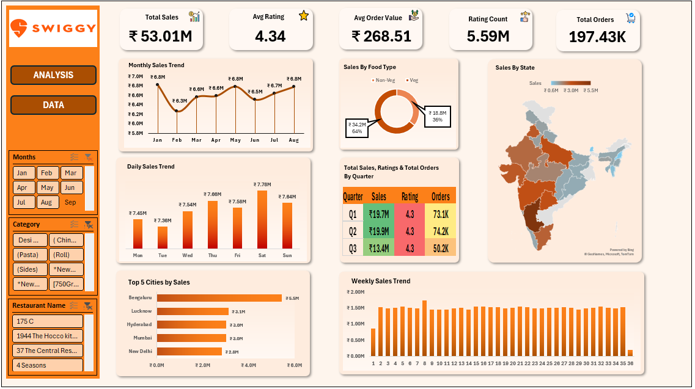

# Swiggy-Sales-Analysis-Excel-Dashboard

## Description
This project is an interactive Microsoft Excel dashboard that analyzes Swiggy food delivery data across multiple cities and restaurants. The dashboard provides insights into pricing, ratings, food categories, and regional trends to support data-driven business decisions.

## Tools Used
- Microsoft Excel
- Pivot Tables
- Pivot Charts
- Slicers
- Dashboard Design

## Objectives
- Analyze restaurant pricing and customer ratings
- Identify top-performing cities and states
- Compare food categories and dish popularity
- Explore trends over time
- Build an interactive dashboard for business insights

## Business Questions Addressed
1. Which states and cities have the highest number of listings?
2. Which restaurants have the highest ratings?
3. What are the most popular food categories?
4. Which dishes have the highest ratings and rating counts?
5. How do prices vary across cities and food types?
6. Which restaurants offer the best value for money?
7. How do ratings and prices change over time?

## Key Insights
- Top-rated restaurants consistently maintain high customer satisfaction.
- Certain cities have a larger concentration of highly rated restaurants.
- Popular food categories generate significantly more customer engagement.
- Premium-priced dishes do not always receive the highest ratings.
- Rating count helps identify restaurants with strong customer trust.

## Conclusion and Recommendations
The analysis highlights opportunities to identify top-performing restaurants, popular food categories, and high-demand locations. Swiggy can use these insights to optimize restaurant partnerships, improve customer recommendations, and focus promotions on the most profitable segments.

## Files Included
- Swiggy_Sales_Analysis.xlsx
- dashboard.png
- README.md

## Download Project File
[Download the Excel Dashboard](Swiggy_Sales_Analysis.xlsx)

## Dashboard Preview

